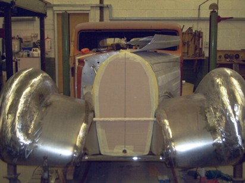

<!DOCTYPE html PUBLIC "-//W3C//DTD XHTML 1.0 Transitional//EN" "http://www.w3.org/TR/xhtml1/DTD/xhtml1-transitional.dtd">
<html xmlns="http://www.w3.org/1999/xhtml" xml:lang="en" lang="en" id="cbhp">
<head>
    <meta name="DC.type" http-equiv="Content-Type" content="text/html; charset=UTF-8" />
    <meta name="keywords" content="Vehicle Restorations and Consultancy; Vintage; Historic; Car; PVT; Pre War; VSCC; HSCC; Veteran; Racing; Race; Competition; Panel Beat; English Wheel; Planish; Aluminium; Welding; Owners Club; AC; Alfa; Alfa Romeo; Alvis; Alta; Aston Martin; Arnolt; Austin; Austin Healey; Bentley; BMW; BMW 315; BMW 319; BMW 328;BMW 327; Bristol; Bugatti; Cooper; Daimler; Delage; Delahaye; ERA; Facel Vega; Ferrari; Fiat; Frazer Nash; Jaguar; Lancia; Lagonda; Lotus; Maserati; MG; Morris; OSCA; Porsche; Riley; Rolls Royce; Sunbeam; Talbot; Roesch; Berkshire; Buckingham; Dorset; Devon; Gloucester; Hampshire; Hereford; Shropshire; Oxford; Somerset; Wales; Wiltshire; Worcester;" />
    <meta name="description" content="Panelbeating, and restoration for historic and vintage, road and race cars. Based in Wiltshire with clients across the UK Europe and America we supply top quality body work in steel and aluminium."/>
    <title>Coachbuilt Cars Ltd | Panel Beating and Restoration | Home</title>
    <link type="text/css" rel="stylesheet" href="css/ch1.css" />
    <link type="image/x-icon" rel="shortcut icon" href="favicon.ico" />
    <link type="image/x-icon" rel="icon" href="favicon.ico" />
</head>
<body>

   

   

   
<ul>
      <li><a href="ch_index.htm" class="ison">Home</a></li>
      <li><a href="ch_contact.htm">Contact</a></li>
      <li><a href="ch_parts.htm">Parts</a></li>
      <li><a href="ch_projects.htm">Projects</a></li>
      <li><a href="ch_bristols.htm">Bristols</a></li>
      <li><a href="ch_bmw_nash.htm">BMWs and Nashs</a></li>
      <li><a href="ch_for_sale.htm">For Sale</a></li>
      <li><a href="ch_storage.htm">Storage</a></li>
      <li><a href="ch_links.htm">Links</a></li>
   </ul>

   

      

         
         
         
         
         
         
         
         
         
         
         
         
         
         
            
      

      <h3>Welcome to Coachbuilt Cars.</h3>
      
For everything from piece components to full restoration, or a complete body created from scratch, Coachbuilt Cars offers quality engineering for motor vehicles of all types.

      
Please look at our <a href="ch_projects.htm">projects</a> for just a few examples of our work or
      <a href="ch_contact.htm">contact us</a> to discuss your needs.

      <table class="newstable"><tr>
         <td>
<b>LATEST NEWS:</b>
         Busy times with <a href="ch_projects.htm">Projects</a> being completed and our own Special out at events. See photos on the <a href="ch_bmw_nash.htm">BMWs and Nashes</a> page.
</td>
      </tr></table>
   

   

      Material Copyright &copy; 2019 Coachbuilt Cars Ltd. Registered in England and Wales No. 7399185
       Reg. Office: 2 Church St, Burnham, SL1 7HZ.

</body>
</html>
